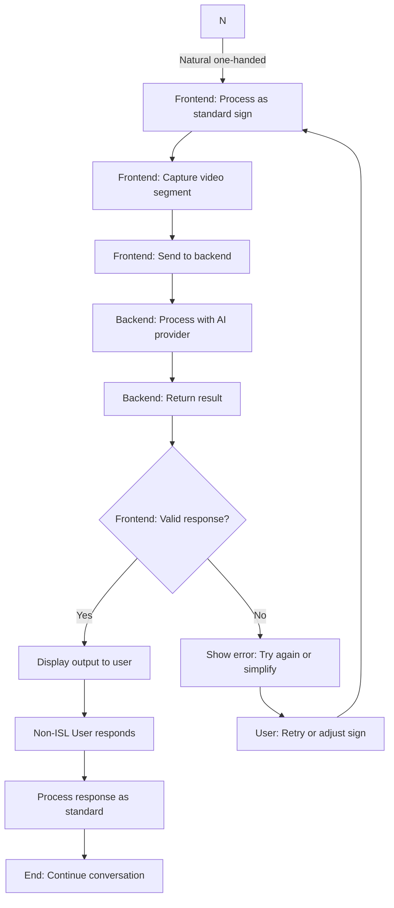
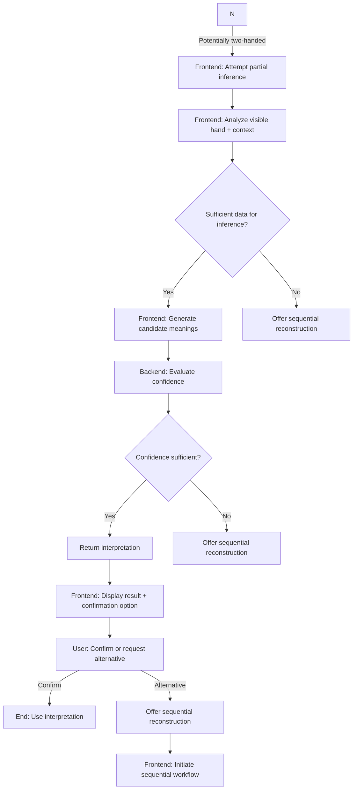
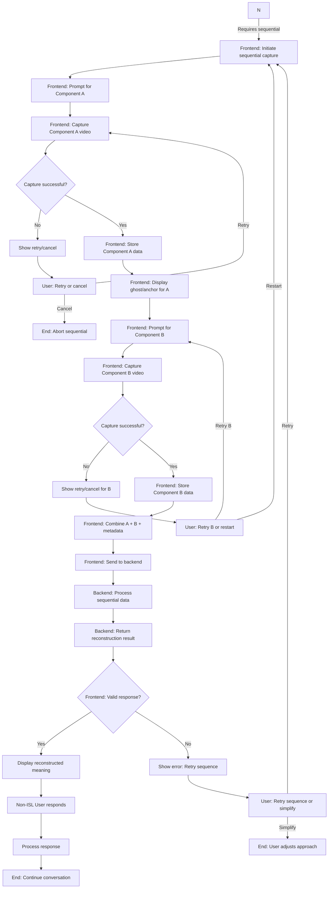
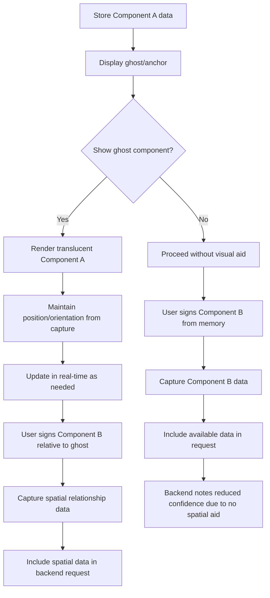
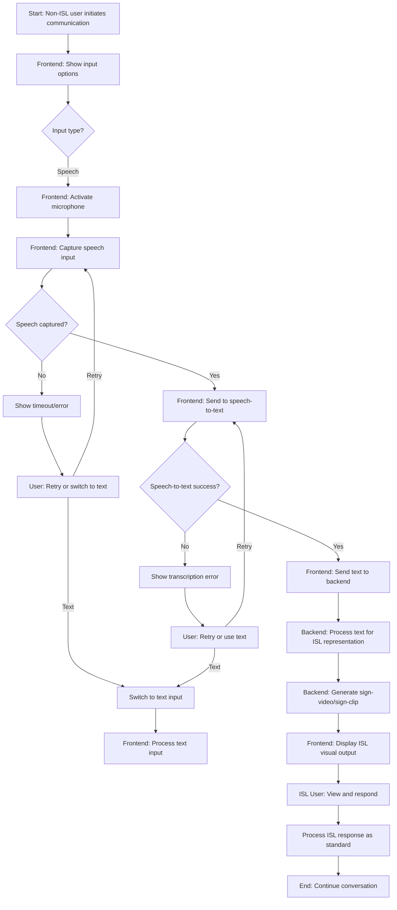
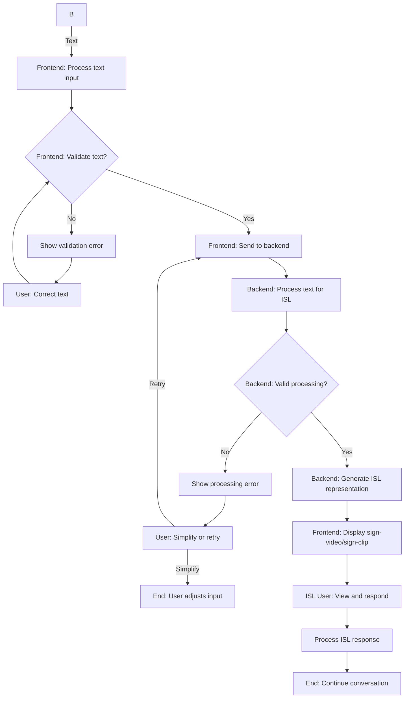
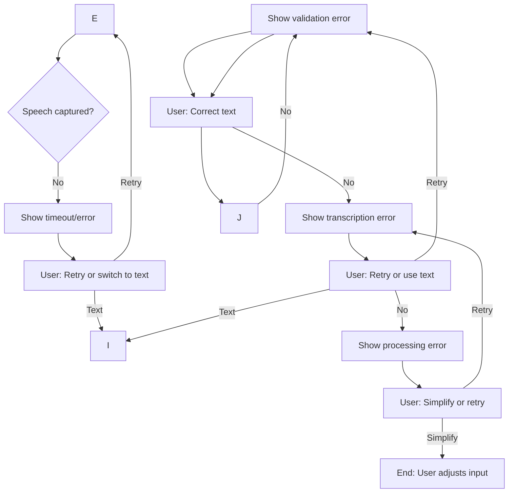
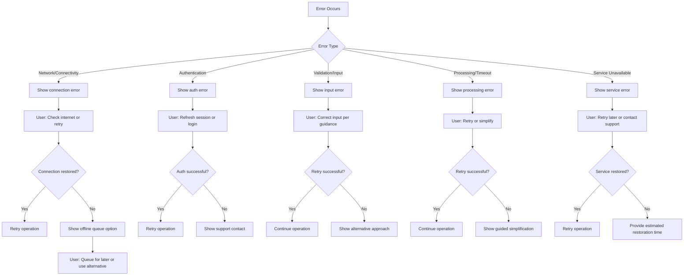
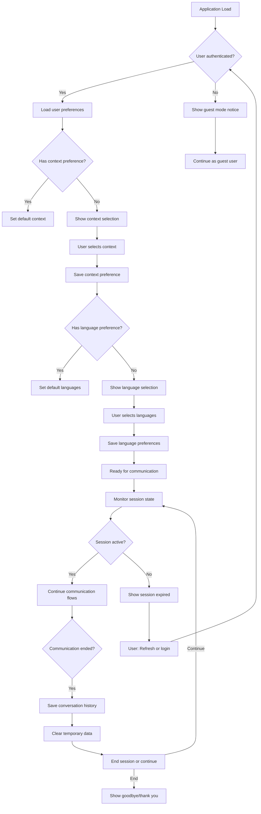

# BharatSign Bridge - Application Flowcharts

## 1. Overview

This document outlines the application flowcharts for BharatSign Bridge, illustrating the technical processes and user interactions for all major scenarios. Each flowchart includes both success paths and error handling mechanisms.

## 2. Standard ISL Communication Flowchart

### 2.1 Success Path

```mermaid
flowchart TD
    A[Start: User grants camera/mic access] --> B[Frontend: Initialize camera preview]
    B --> C[User signs with both hands visible]
    C --> D[Frontend: Capture video segment (2-5 sec)]
    D --> E[Frontend: Send video to backend API]
    E --> F[Backend: Validate request]
    F --> G[Backend: Select AI provider adapter]
    G --> H[Backend: Format request for external AI]
    H --> I[External AI: Process video]
    I --> J[External AI: Return structured response]
    J --> K[Backend: Normalize response]
    K --> L[Backend: Apply context & confidence logic]
    L --> M{Confidence Level?}
    M -->|High| N[Backend: Return translation]
    M -->|Medium| O[Backend: Return translation + confirmation option]
    M -->|Low| P[Backend: Request clarification]
    N --> Q[Frontend: Display text/speech output]
    O --> Q
    P --> R[Frontend: Show clarification request]
    R --> S[User: Repeat sign or provide alternative]
    S --> C
    Q --> T[Non-ISL User: Respond via speech/text]
    T --> U[Frontend: Process speech/text input]
    U --> V[Backend: Generate ISL representation]
    V --> W[Frontend: Display ISL visual output]
    W --> X[End: Conversation continues]
```

### 2.2 Error Handling Flows

```mermaid
flowchart TD
    A[Start: User grants camera/mic access] --> B[Frontend: Initialize camera preview]
    B --> C{Camera Access?}
    C -->|Denied| D[Frontend: Show permission request]
    D --> E[User: Grant or deny permission]
    E -->|Granted| C
    E -->|Denied| F[Frontend: Show alternative input options]
    F --> G[End: Limited functionality available]
    
    C -->|Granted| H[Frontend: Start video capture]
    H --> I{Capture Successful?}
    I -->|Failed| J[Frontend: Show retry/cancel options]
    J --> K[User: Retry or cancel]
    K -->|Retry| H
    K -->|Cancel| L[End: Operation cancelled]
    
    I -->|Successful| M[Frontend: Send video to backend]
    M --> N[Backend: Validate request]
    N --> O{Request Valid?}
    O -->|Invalid| P[Backend: Return 400 error]
    P --> Q[Frontend: Show validation error]
    Q --> R[User: Correct and resend]
    R --> M
    
    O -->|Valid| S[Backend: Call AI provider]
    S --> T{AI Provider Response?}
    T -->|Timeout| U[Backend: Return 504 error]
    U --> V[Frontend: Show timeout error]
    V --> W[User: Retry or use alternative]
    W -->|Retry| S
    W -->|Alternative| X[End: Fallback to manual communication]
    
    T -->|Error (5xx)| Y[Backend: Return 503 error]
    Y --> Z[Frontend: Show service unavailable]
    Z --> AA[User: Retry later or contact support]
    AA -->|Retry| S
    AA -->|Support| AB[End: Contact support]
    
    T -->|Success| AC[Backend: Normalize response]
    AC --> AD{Response Valid?}
    AD -->|Invalid| AE[Backend: Log error]
    AE --> AF[Backend: Return 502 error]
    AF --> AG[Frontend: Show processing error]
    AG --> AH[User: Retry or simplify input]
    AH -->|Retry| M
    AH -->|Simplify| AI[End: User adjusts signing]
    
    AD -->|Valid| AJ[Continue to confidence evaluation]
```

## 3. Personal Mode Flowchart

### 3.1 Mode Detection & Initialization

```mermaid
flowchart TD
    A[Start: Video stream active] --> B[Frontend: Analyze video for hand visibility]
    B --> C{Hands Visible?}
    C -->|Both hands| D[Standard mode: Continue normal processing]
    D --> E[Process as standard ISL communication]
    
    C -->|One hand| F[Frontend: Detect device hold scenario]
    F --> G{Device hold detected?}
    G -->|No| H[Prompt user: "Are you holding device?"]
    H --> I[User: Confirm or deny]
    I -->|Confirm| J[Activate Personal Mode]
    I -->|Deny| K[Continue standard mode analysis]
    K --> B
    
    G -->|Yes| J[Activate Personal Mode]
    J --> L[Frontend: Show personal mode UI]
    L --> M[Frontend: Guide user through interaction options]
    M --> N{Sign Type Detection}
```

### 3.2 Natural One-Handed Sign Path



### 3.3 Partial Reconstruction Path



### 3.4 Sequential Articulation Reconstruction Path



### 3.5 Virtual Anchor / Ghost-Hand Mechanism



## 4. Reverse Communication Flowchart

### 4.1 Speech-to-ISL Path



### 4.2 Text-to-ISL Path



### 4.3 Error Handling for Reverse Communication



## 5. Error Handling & Recovery Patterns

### 5.1 Common Error Categories



### 5.2 Confidence Handling Flow

```mermaid
flowchart TD
    A[AI Response Received] --> B{Evaluate confidence}
    B -->|High confidence| C[Auto-translate & display]
    B -->|Medium confidence| D[Show translation + confirmation]
    D --> E{User action?}
    E -->|Confirm| F[Accept translation]
    E -->|Request clarification| G[Ask for repetition/alternative]
    E -->|Ignore/timeout| H[Auto-reject after timeout]
    H --> I[Show: "Not understood, please try again"]
    I --> J[User: Repeat or adjust]
    
    B -->|Low confidence| K[Do not guess]
    K --> L[Show clarification request]
    L --> M[Options: Repeat, alternative component, choose from candidates]
    M --> N{User selected option}
    N -->|Repeat| O[Request same sign again]
    N -->|Alternative component| P[Request different signing approach]
    N -->|Choose candidate| Q[Present candidate meanings]
    Q --> R[User selects meaning]
    R --> S[Use selected meaning]
    S --> T[Continue conversation]
    
    O --> A
    P --> A
```

## 6. State Management Flow



## 7. Data Flow Summary

### 7.1 Video Processing Data Flow
```
Camera → MediaRecorder → Blob/ArrayBuffer → Base64/URL → HTTPS POST → 
Backend Validation → AI Provider Adapter → External AI API → 
Structured JSON Response → Response Normalization → Business Logic → 
HTTPS Response → Frontend Update → UI Display
```

### 7.2 Sequential Component Data Flow
```
Component A Capture → Feature Extraction (shape, orientation, etc.) → 
Temporary Storage → Ghost/Anchor Display → Component B Capture → 
Feature Extraction → Spatial Relationship Calculation → 
Combined Data Package → HTTPS POST → Backend Processing → 
Reconstruction Engine → Candidate Generation → Confidence Evaluation → 
Response → Frontend Display
```

### 7.3 Reverse Communication Data Flow
```
Speech Input → Web Speech API/Text Processing → Text Validation → 
HTTPS POST → Backend Processing → ISL Representation Generation → 
Sign-video/sign-clip Selection/Generation → HTTPS Response → 
Frontend Display → ISL User Consumption
```

## 8. Flowchart Implementation Notes

### 8.1 Technical Implementation
- All flowcharts represent logical processes; actual implementation may combine or split steps
- Error handling flows are designed to be resilient and provide clear user guidance
- Timeout values should be configurable based on network conditions
- Retry mechanisms should implement exponential backoff where appropriate
- User guidance should be context-aware and actionable

### 8.2 User Experience Considerations
- Flowcharts prioritize clear error recovery paths over preventing all errors
- Users should always have an "out" or alternative path when encountering difficulties
- Confirmation steps prevent unintended actions in medium-confidence scenarios
- Progressive disclosure keeps interfaces simple while providing advanced options

### 8.3 Monitoring and Analytics
- Key decision points in flowcharts should be instrumented for analytics
- Error paths should be tracked to identify common failure modes
- Success metrics should be measured at major flowchart endpoints
- User journey completion rates should be monitored for optimization

---
*Document Version: 1.0*
*Last Updated: 2026-09-26*
*Product: BharatSign Bridge*
*Target Release: Production*